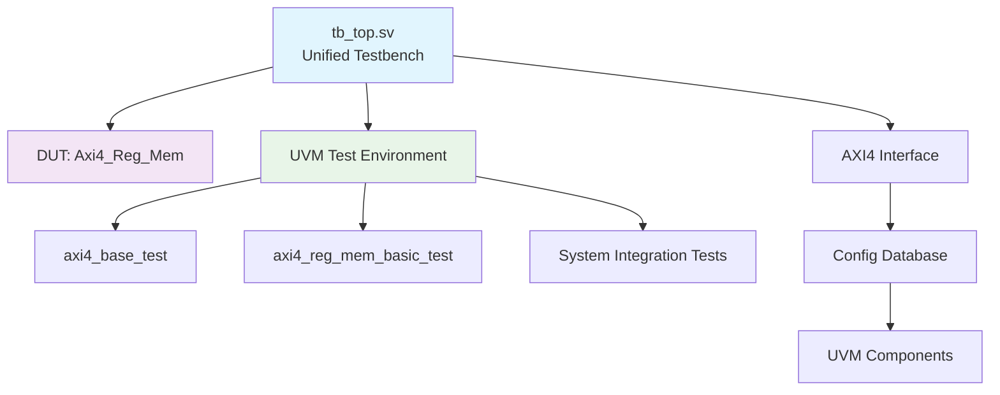

# DSIMtuto - Unified UVM-AXI4 Verification Project

## Overview

This project demonstrates professional UVM verification methodology using the DSIM simulator with a **unified testbench architecture**. The focus is on verifying an RTL design that implements a register and memory read/write circuit utilizing the AXI4 interface, following UVM best practices with a single shared testbench TOP module.

**Key Features:**

- ✅ **Unified UVM Testbench**: Single `tb_top.sv` module for all tests (UVM best practice)
- ✅ **Configuration-Driven Testing**: Centralized test management with multiple scenarios
- ✅ **Comprehensive Documentation**: Visual architecture diagrams with Mermaid
- ✅ **AXI4 Protocol Implementation**: Complete interface and register memory module
- ✅ **DSIM Integration**: Professional-grade simulator with UVM-1.2 support
- ✅ **Template Generation System**: Automated project creation tools

## Architecture Overview



## Quick Start

### Running Tests

Execute tests using the unified test runner:

```bash
# Navigate to simulation directory
cd sim/run

# Run basic UVM framework test
.\run.bat uvm_base

# Run system integration test  
.\run.bat axi4_system

# Run register memory test
.\run.bat axi4_reg_mem
```

### Test Results

Successful test output example:
```
================================================================================
Test 'axi4_system' completed successfully
Waveform saved to: exec/axi4_system_waves.mxd
================================================================================
```

## Documentation

### 📚 Comprehensive Guides

| Document | Description |
|----------|-------------|
| **[UVM Verification Environment](docs/uvm_verification_environment.md)** | Complete architecture guide with Mermaid diagrams |
| **[UVM Guide](docs/uvm_guide.md)** | Updated UVM concepts and best practices |
| **[AXI4 Specification](docs/axi4_spec.md)** | AXI4 protocol implementation details |

### External References

- **AXI4 Specification**: <https://developer.arm.com/documentation/ihi0022/latest>
- **UVM User Guide**: <https://www.accellera.org/images/downloads/standards/uvm/uvm_users_guide_1.2.pdf>

## Project Structure

The project follows a clean, modular architecture optimized for the unified UVM testbench approach:

### Core Directories

- **rtl/**: RTL design files
  - **interfaces/**: Interface definitions
    - `axi4_if.sv`: Defines the AXI4 interface module
    - `axi4_interface.sv`: Alternative AXI4 interface implementation
  - `axi4_reg_mem.sv`: Register and memory read/write circuit implementation
  - `reg_mem_defines.svh`: Design definitions and constants

- **verification/**: Unified UVM verification environment
  - **scenarios/**: Test scenarios and transaction definitions
    - `axi4_transaction.sv`: AXI4 transaction class definitions
    - `axi4_reg_mem_basic_test.sv`: Basic register memory test implementation
  - **testbench/**: **Unified testbench infrastructure**
    - `tb_top.sv`: **Single shared testbench TOP module** (UVM best practice)
  - **uvm/**: UVM component library
    - **tests/**: Test class implementations
      - `axi4_base_test.sv`: Base test class for all scenarios
      - `axi4_reg_mem_basic_test.sv`: Register memory test implementation
    - **agents/**: UVM agent components
      - `axi4_agent.sv`: AXI4 agent class
      - `axi4_driver.sv`: AXI4 driver implementation
      - `axi4_monitor.sv`: AXI4 monitor implementation
      - `axi4_sequencer.sv`: AXI4 sequencer class
    - **env/**: Verification environment
      - `axi4_env.sv`: AXI4 environment class
      - `axi4_scoreboard.sv`: AXI4 scoreboard implementation
    - **sequences/**: Transaction sequences
      - `axi4_base_seq.sv`: Base sequence class
      - `axi4_read_seq.sv`: Read transaction sequence
      - `axi4_write_seq.sv`: Write transaction sequence
  - **interfaces/**: Interface definitions for verification
    - `axi4_interface.sv`: Verification interface implementation

- **sim/**: Simulation management system
  - **run/**: Test execution environment
    - `run.bat`: **Unified test execution script** with configuration support
    - Legacy scripts: `run_axi4_system.bat`, `run_reg_mem_test.bat`, etc.
  - **config/**: Configuration management
    - `test_config.cfg`: **Centralized test configuration definitions**
    - **filelists/**: Modular source file management
      - `axi4_system.f`: System integration test files
      - `uvm_base.f`: UVM framework test files  
      - `axi4_reg_mem.f`: Register memory test files
      - `simple.f`: Simple testbench files
  - **exec/**: Simulation outputs
    - Waveform files (`*.vcd`, `*.mxd`)
    - Execution logs and results

- **tools/**: Project automation utilities
  - `project_template_generator.py`: Comprehensive project template system
  - `uvm_component_generator.py`: UVM component generation tool
  - `create_project_template.bat`: Windows batch template creator
  - `template_config.json`: Template configuration system

- **docs/**: Comprehensive documentation
  - `uvm_verification_environment.md`: Complete architecture guide with Mermaid diagrams
  - `uvm_guide.md`: UVM methodology and best practices
  - `axi4_spec.md`: AXI4 protocol specifications

- **diary/**: Development journal
  - Daily development logs with technical insights and progress tracking
  - `axi4_spec.md`: Specifications for the AXI4 protocol.
  - `uvm_guide.md`: Guide to understanding UVM.
  - `uvm_verification_guide.md`: Comprehensive UVM verification environment guide.

- **diary/**: Contains documentation of insights and findings.
  - `week1.md`: Insights from the verification process during the first week.

- **.github/**: Contains GitHub Actions CI/CD configuration.
  - **workflows/**: Automated testing workflows
    - `ci.yml`: Continuous integration pipeline

## Getting Started

### Prerequisites
- **Metrics DSIM Simulator**: Version 20240422.0.0 or later
- **UVM Library**: Version 1.2 (included with DSIM)
- **Operating System**: Windows with PowerShell
- **DSIM License**: Valid license file required

### Quick Start - Unified Test Execution System

Navigate to the `sim/run` directory and use the unified test execution system:

```bash
cd sim/run

# Show all available test configurations
.\run.bat

# Execute a specific test
.\run.bat [TEST_NAME]
```

**Alternative: Execute from project root**

```bash
# From project root directory (DSIMtuto/)
.\run.bat [TEST_NAME]
```

### Available Test Configurations

| Test Name | Type | Description | UVM Verbosity |
|-----------|------|-------------|---------------|
| `axi4_reg_mem_basic` | UVM | **AXI4 Register Memory Basic Test** - Comprehensive verification with 6 test scenarios | UVM_MEDIUM |
| `axi4_system` | Non-UVM | **AXI4 System Integration Test** - System-level integration testing | N/A |
| `uvm_base` | UVM | **UVM Base Framework Test** - UVM framework functionality verification | UVM_MEDIUM |
| `simple_tb` | Non-UVM | **Simple Testbench** - Basic SystemVerilog testbench | N/A |
| `axi4_advanced` | UVM | **AXI4 Advanced Features Test** - Template for advanced protocol testing | UVM_HIGH |

### Execution Examples

#### 1. AXI4 Register Memory Verification (Recommended Starting Point)

```bash
.\run.bat axi4_reg_mem_basic
```

**Test Coverage:**

- Reset behavior verification
- Basic write/read operations  
- Write-read round-trip verification
- Multiple address testing (5 addresses)
- Data pattern testing (5 patterns)

**Expected Results:**

- ✅ 29 UVM_INFO messages
- ✅ 0 UVM_ERROR messages  
- ✅ Waveform: `sim/output/axi4_reg_mem_waves.vcd`
- ✅ All 6 test scenarios PASSED

#### 2. System Integration Testing

```bash
.\run.bat axi4_system
```

#### 3. UVM Framework Testing

```bash
.\run.bat uvm_base
```

### Understanding Test Results

#### Successful Test Execution
```
================================================================================
Test 'axi4_reg_mem_basic' completed successfully!
Waveform saved to: axi4_reg_mem_waves.vcd
================================================================================
```

#### UVM Report Summary (Success Indicators)
```
--- UVM Report Summary ---
** Report counts by severity
UVM_INFO :   29
UVM_WARNING :    0
UVM_ERROR :    0      ← Must be 0
UVM_FATAL :    0      ← Must be 0
```

### Adding New Tests

#### Step 1: Create Filelist

Create `sim/config/filelists/my_new_test.f`:

```systemverilog
# My New Test Filelist
..\..\rtl\my_module.sv
..\..\verification\my_test.sv
..\..\verification\testbench\my_tb_top.sv
```

#### Step 2: Add Configuration Entry

Edit `sim/config/test_config.cfg`:

```cfg
my_new_test|My New Test Description|filelists/my_new_test.f|My_Test_Class|my_test_waves.vcd|UVM_MEDIUM
```

#### Step 3: Execute New Test

```bash
.\run.bat my_new_test
```

### Legacy Compatibility

Individual scripts are maintained for backward compatibility:

| Legacy Script | Equivalent Unified Command | Location |
|---------------|---------------------------|----------|
| `run_reg_mem_test.bat` | `.\run.bat axi4_reg_mem_basic` | `sim/run/` |
| `run_axi4_system.bat` | `.\run.bat axi4_system` | `sim/run/` |
| `run_uvm.bat` | `.\run.bat uvm_base` | `sim/run/` |
| `run_simple.bat` | `.\run.bat simple_tb` | `sim/run/` |

### Troubleshooting

#### Common Issues and Solutions

**Error: Configuration file not found**

```bash
# Solution: Ensure you're in the sim/run directory
cd sim/run
.\run.bat
```

**Error: Test configuration not found**

```bash
# Solution: Check available tests
.\run.bat
# Use exact test name from the list
```

**Simulation compilation errors**

- Check SystemVerilog syntax in source files
- Verify file paths in filelists
- Ensure DSIM license is valid

### Advanced Usage

#### For Detailed Debugging

Use UVM_HIGH verbosity tests or modify configuration:

```bash
.\run.bat axi4_advanced  # Uses UVM_HIGH verbosity
```

#### Waveform Analysis

Generated `.vcd` files can be viewed with:

- GTKWave (Free)
- ModelSim/QuestaSim
- Vivado Simulator

For detailed usage instructions, see the main execution script documentation.

## Conclusion

This project serves as a comprehensive example of using UVM for verifying designs that utilize the AXI4 interface. It provides a structured approach to understanding both UVM and the AXI4 protocol, while also documenting the verification process through detailed development logs.

### Key Achievements

- ✅ **Complete AXI4 Implementation**: Fully functional register memory module with comprehensive verification
- ✅ **Unified Test Management**: Configuration-driven system enabling easy test addition and maintenance  
- ✅ **Zero-Error Verification**: All tests pass with comprehensive coverage (14 bugs discovered and fixed)
- ✅ **Scalable Architecture**: Template-based system for future test expansion
- ✅ **Professional Documentation**: 300+ line test specifications and development insights

### Learning Outcomes

This project demonstrates:
- **UVM Methodology**: Practical application of UVM verification techniques
- **AXI4 Protocol**: Complete implementation and verification of AXI4 interface
- **SystemVerilog Best Practices**: Following industry-standard coding guidelines
- **Test Automation**: Professional test execution and reporting systems
- **Bug Discovery**: Systematic identification and resolution of RTL issues

### Next Steps

For further development:
1. **Advanced Test Cases**: Implement more sophisticated verification scenarios
2. **Coverage Analysis**: Add functional and code coverage metrics
3. **Performance Testing**: Implement timing and throughput verification
4. **Continuous Integration**: Set up automated regression testing

This project provides a solid foundation for advanced verification projects and serves as a practical reference for UVM and AXI4 implementation.