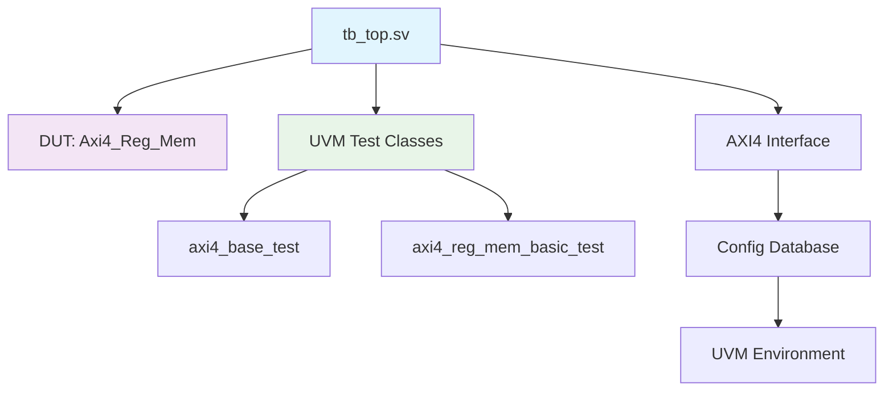
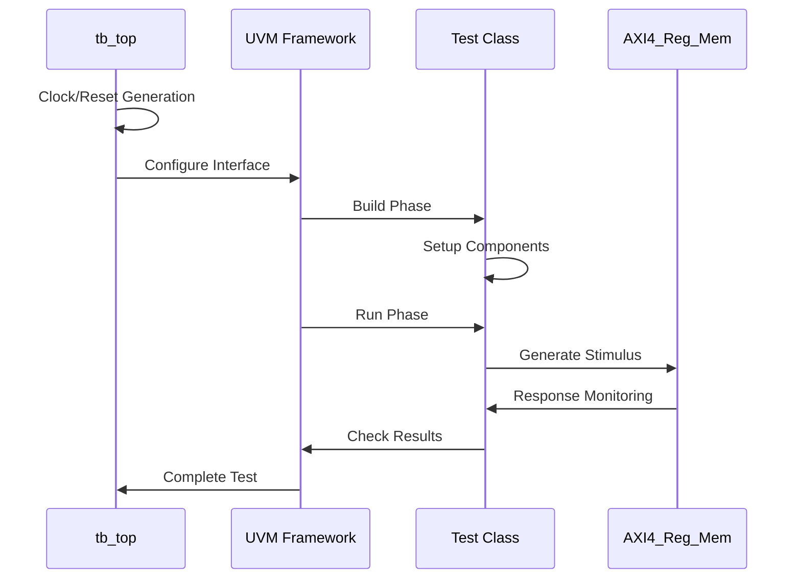

# UVM Guide

## Introduction to UVM

The Universal Verification Methodology (UVM) is a standardized methodology for verifying integrated circuit designs. It provides a framework for creating reusable verification components and environments, enabling efficient and effective verification of complex designs.

This project implements a **unified UVM testbench architecture** following UVM best practices with a single shared testbench TOP module.

## Key Concepts

### 1. UVM Components

UVM is built around several key components, including:

- **Agents**: Responsible for driving and monitoring transactions on the interface.
- **Drivers**: Implement the logic to send transactions to the DUT (Design Under Test).
- **Monitors**: Observe the DUT and collect transaction data for analysis.
- **Scoreboards**: Compare expected results with actual results to verify correctness.
- **Sequences**: Define a series of transactions to be executed by the driver.

### 2. UVM Phases

UVM operates in a series of phases that control the execution of the verification environment:

- **Build Phase**: Components are instantiated and connected.
- **Connect Phase**: Signals are connected between components.
- **Run Phase**: The actual simulation runs, executing the defined sequences and transactions.
- **Report Phase**: Results are reported and analyzed.

### 3. Unified Testbench Architecture

This project follows UVM best practices by implementing:

- **Single Testbench TOP**: One `tb_top.sv` module for all tests
- **Interface Hierarchy**: Proper UVM config database management
- **Test Modularity**: Separate test classes for different scenarios
- **Reusable Components**: Shared verification infrastructure

## Project Structure

### Unified Testbench Hierarchy



## Setting Up a UVM Testbench

To work with the unified UVM testbench in this project:

### 1. Understanding the Architecture

The testbench uses a unified architecture where:

```systemverilog
// Single testbench TOP module
module tb_top;
    // Clock and reset generation
    // DUT instantiation
    // Interface configuration
    // UVM environment setup
endmodule
```

### 2. Running Tests

Execute tests using the run script with test configurations:

```bash
# Run base UVM test
.\run.bat uvm_base

# Run system integration test
.\run.bat axi4_system

# Run register memory test
.\run.bat axi4_reg_mem
```

### 3. Test Development

Create new tests by extending the base test class:

```systemverilog
class my_custom_test extends axi4_base_test;
    `uvm_component_utils(my_custom_test)
    
    function new(string name = "my_custom_test", uvm_component parent = null);
        super.new(name, parent);
    endfunction
    
    virtual task main_phase(uvm_phase phase);
        // Custom test implementation
    endtask
endclass
```

### 4. Interface Usage

Access the AXI4 interface through the UVM config database:

```systemverilog
virtual axi4_if vif;

function void build_phase(uvm_phase phase);
    super.build_phase(phase);
    if (!uvm_config_db#(virtual axi4_if)::get(this, "", "vif", vif))
        `uvm_fatal("NOVIF", "Virtual interface not found")
endfunction
```

## Test Execution Flow

### Phase Execution



## Debugging Tips

### 1. UVM Reporting

Use structured UVM logging:

```systemverilog
`uvm_info("TEST", "Starting test sequence", UVM_MEDIUM)
`uvm_error("TEST", "Unexpected response detected")
```

### 2. Waveform Analysis

The unified testbench generates multiple waveform formats:

- **MXD format**: Advanced debugging with DSim
- **VCD format**: Universal compatibility

### 3. Interface Debugging

Common interface issues and solutions:

```systemverilog
// Check interface configuration
if (!uvm_config_db#(virtual axi4_if)::get(null, "*", "vif", vif))
    `uvm_fatal("CONFIG", "Interface not found in config database")
```

### 4. Incremental Development

- Start with simple base tests
- Add complexity gradually
- Use unified testbench for consistency
- Validate each test independently

## Advanced Features

### 1. Multiple Test Scenarios

The unified testbench supports various test types:

| Test Type | Purpose | Filelist |
|-----------|---------|----------|
| `axi4_base_test` | Framework validation | `uvm_base.f` |
| `axi4_reg_mem_basic_test` | Register testing | `axi4_reg_mem.f` |
| System tests | Integration testing | `axi4_system.f` |

### 2. Configuration Management

Tests are configured through:

- UVM config database
- Test-specific parameters
- Runtime plusargs
- Filelist configuration

### 3. Coverage Collection

The framework supports:

- Functional coverage through UVM
- Code coverage via simulator
- Assertion-based verification
- Protocol compliance checking

## Best Practices

### 1. Test Development

- Extend from `axi4_base_test`
- Use proper UVM phases
- Implement clean test structure
- Document test objectives

### 2. Interface Management

- Always use config database
- Verify interface connectivity
- Handle interface hierarchy properly
- Use consistent naming

### 3. Debugging Strategy

- Start with UVM_LOW verbosity
- Increase verbosity for problem areas
- Use waveforms for signal analysis
- Check UVM objection handling

## Conclusion

The unified UVM testbench architecture provides:

- **Maintainability**: Single point of infrastructure management
- **Scalability**: Easy addition of new test scenarios
- **UVM Compliance**: Follows standard UVM practices
- **Debug Capability**: Comprehensive debugging support

By following this structured approach and utilizing the unified testbench, you can effectively verify complex AXI4-based designs while maintaining clean, reusable verification code.

---

Updated for unified testbench architecture - July 19, 2025