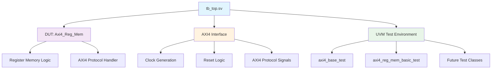
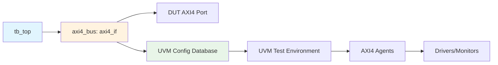
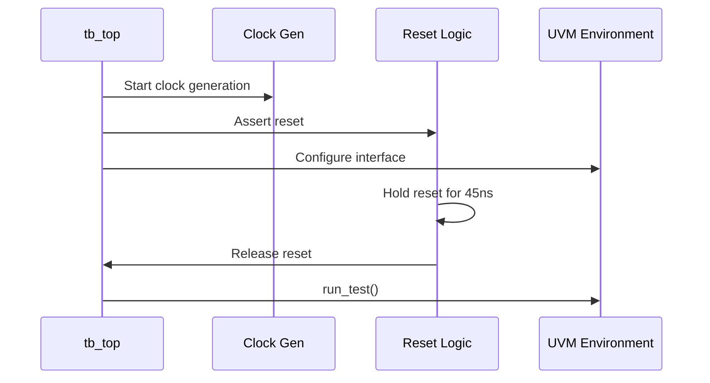

# UVM Verification Environment

## Overview

This document describes the unified UVM verification environment for the AXI4 Register Memory system. The verification environment follows UVM best practices with a single shared testbench TOP module that supports multiple test configurations.

## Architecture Overview

The verification environment consists of the following key components:

- **Unified Testbench TOP**: Single `tb_top.sv` module shared across all tests
- **UVM Test Classes**: Various test scenarios extending from base test class
- **DUT (Design Under Test)**: AXI4 Register Memory module
- **Interface Layer**: AXI4 interface for protocol communication
- **Configuration System**: UVM config database for runtime configuration

## Testbench Hierarchy



## File Structure

### Core Testbench Files

```text
verification/
├── testbench/
│   └── tb_top.sv              # Unified testbench TOP module
├── uvm/
│   ├── tests/
│   │   ├── axi4_base_test.sv         # Base test class
│   │   └── axi4_reg_mem_basic_test.sv # Register memory test
│   ├── agents/
│   ├── env/
│   └── sequences/
└── interfaces/
    └── axi4_interface.sv       # AXI4 protocol interface
```

### Configuration Files

```text
sim/config/filelists/
├── axi4_system.f              # Complete system test
├── uvm_base.f                 # UVM framework test
└── axi4_reg_mem.f            # Register memory focused test
```

## Unified Testbench Architecture

### tb_top.sv Features

The unified testbench TOP module provides:

1. **Universal DUT Instantiation**

   ```systemverilog
   Axi4_Reg_Mem dut (
       .clk(clk),
       .rst_n(rst_n),
       .axi4_if(axi4_bus)
   );
   ```

2. **Clock and Reset Generation**

   ```systemverilog
   always #5 clk = ~clk;  // 100MHz clock
   
   initial begin
       rst_n = 0;
       #45 rst_n = 1;  // Release reset after 45ns
   end
   ```

3. **UVM Environment Setup**

   ```systemverilog
   initial begin
       uvm_config_db#(virtual axi4_if)::set(null, "*", "vif", axi4_bus);
       run_test();
   end
   ```

4. **Waveform Generation**
   - MXD format (primary) for advanced debugging
   - VCD format (compatibility) for standard tools

## Test Configuration System

### Test Selection

Tests are selected using the `+UVM_TESTNAME` parameter:

```bash
# Run base framework test
dsim +UVM_TESTNAME=axi4_base_test ...

# Run register memory test
dsim +UVM_TESTNAME=axi4_reg_mem_basic_test ...
```

### Filelist Configuration

Each test configuration uses specific filelists:

| Test Type | Filelist | Description |
|-----------|----------|-------------|
| `axi4_system` | `axi4_system.f` | Complete system integration test |
| `uvm_base` | `uvm_base.f` | UVM framework validation |
| `axi4_reg_mem` | `axi4_reg_mem.f` | Register memory focused testing |

## Interface Configuration

### AXI4 Interface Hierarchy



The interface is configured in the UVM config database with hierarchy `"*"` to allow access from all UVM components:

```systemverilog
uvm_config_db#(virtual axi4_if)::set(null, "*", "vif", axi4_bus);
```

## Test Execution Flow

### 1. Initialization Phase



### 2. Test Execution

1. **Environment Setup**: UVM constructs test environment
2. **DUT Reset**: Reset sequence applied to DUT
3. **Test Stimulus**: Test-specific stimulus generation
4. **Response Checking**: Monitor and verify DUT responses
5. **Test Completion**: Clean shutdown and report generation

## Benefits of Unified Architecture

### 🎯 Key Advantages

1. **Maintenance Efficiency**
   - Single point of maintenance for testbench infrastructure
   - Consistent environment across all tests
   - Reduced code duplication

2. **UVM Compliance**
   - Follows UVM standard practices
   - Proper interface hierarchy management
   - Standardized configuration approach

3. **Scalability**
   - Easy addition of new test classes
   - Reusable testbench infrastructure
   - Configurable test parameters

4. **Debug Capability**
   - Unified waveform generation
   - Consistent signal naming
   - Standardized debug information

## Test Development Guidelines

### Adding New Tests

1. **Create Test Class**

   ```systemverilog
   class my_new_test extends axi4_base_test;
       `uvm_component_utils(my_new_test)
       
       function new(string name = "my_new_test", uvm_component parent = null);
           super.new(name, parent);
       endfunction
       
       virtual task main_phase(uvm_phase phase);
           // Test implementation
       endtask
   endclass
   ```

2. **Update Filelist**
   - Add test file to appropriate `.f` file
   - Ensure all dependencies are included

3. **Test Execution**

   ```bash
   .\run.bat test_config +UVM_TESTNAME=my_new_test
   ```

### Best Practices

1. **Interface Usage**
   - Always use the unified `axi4_bus` interface
   - Access via UVM config database
   - Follow proper UVM hierarchy

2. **Reset Handling**
   - Use the standard reset sequence (45ns assertion)
   - Synchronize test start with reset deassertion
   - Monitor reset status in test phases

3. **Waveform Generation**
   - MXD format provides advanced debugging features
   - VCD format ensures tool compatibility
   - Both formats generated automatically

## Troubleshooting

### Common Issues

1. **Interface Not Found**

   ```text
   UVM_FATAL: Virtual interface not found in config database
   ```

   **Solution**: Ensure interface is properly configured with `"*"` hierarchy

2. **Module Not Found**

   ```text
   ERROR: Unable to find definitions for module Axi4_Reg_Mem
   ```

   **Solution**: Add DUT files to filelist (`.sv` files and include files)

3. **Test Not Found**

   ```text
   UVM_FATAL: Test class not found
   ```

   **Solution**: Verify test class is included in filelist and properly registered

## Performance Metrics

### Simulation Performance

| Test Type | Compile Time | Simulation Time | Waveform Size |
|-----------|--------------|-----------------|---------------|
| `axi4_base_test` | ~2s | ~100ns | ~50KB |
| `axi4_reg_mem_basic_test` | ~2s | ~500ns | ~200KB |

### Coverage Metrics

The unified testbench supports comprehensive coverage collection:

- Functional coverage through UVM
- Code coverage via simulator
- Assertion-based verification

## Future Enhancements

### Planned Improvements

1. **Advanced Test Classes**
   - Constrained random testing
   - Error injection scenarios
   - Performance benchmarking

2. **Enhanced Monitoring**
   - Protocol compliance checking
   - Performance monitoring
   - Advanced assertions

3. **Automation Features**
   - Automated regression testing
   - Results comparison
   - Coverage reporting

---

*Last Updated: July 19, 2025*  
*Version: 2.0 - Unified Testbench Architecture*
